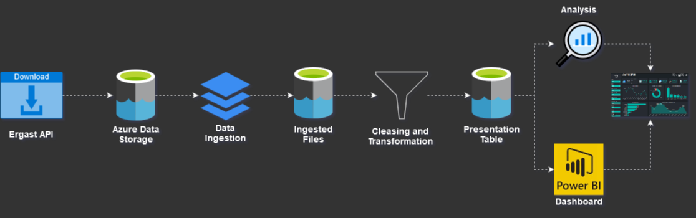
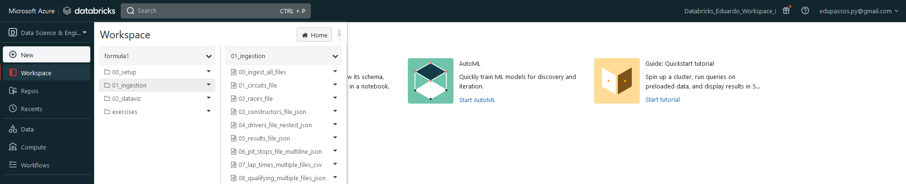
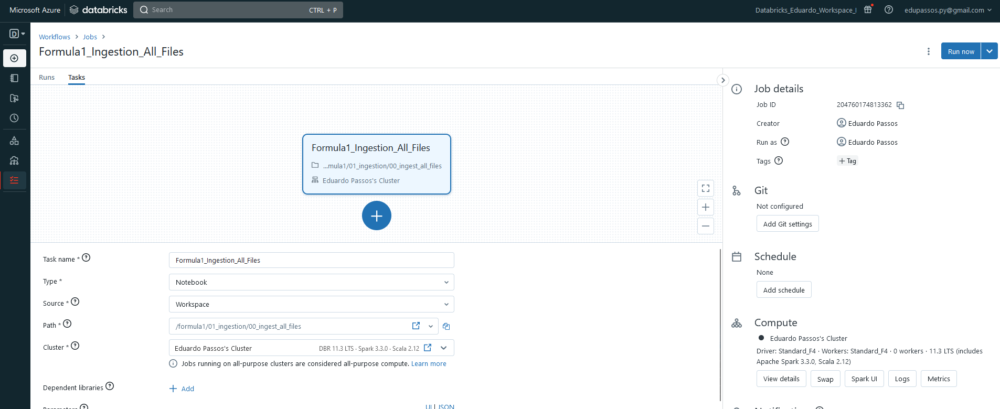
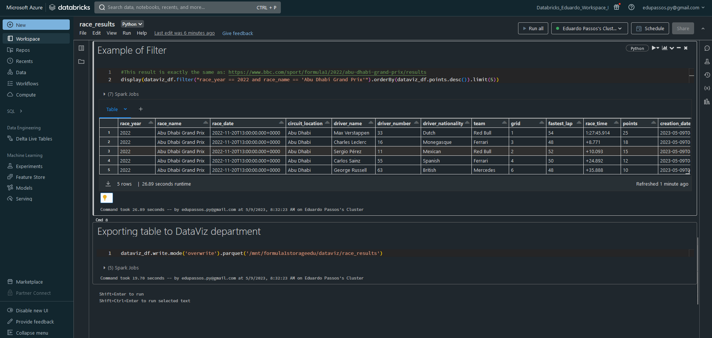
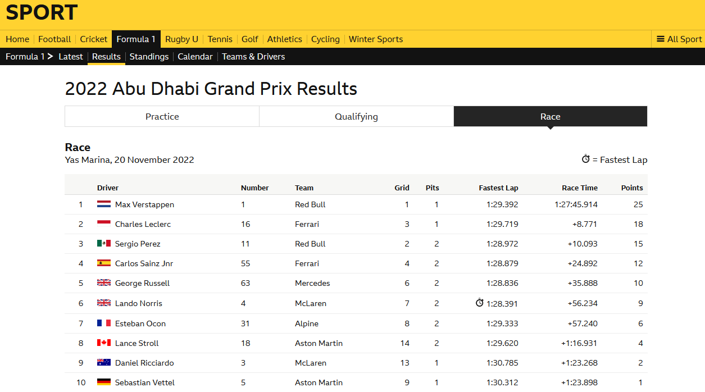

# Formula 1 Results - Data Engineering Project

This project was developed by Eduardo Passos using the Microsoft Azure environment. The leading technologies used were PySpark and Databricks to create the data frames, workflows, and transformations.

## Archtecture

* **Download Ergast CSV files:** The Ergast website provides CSV files with historical Formula 1 data. The first step of this project was to download these files to be used as the data source.

* **Storing the data on Azure Storage:** The downloaded CSV files were stored on Azure Storage. This cloud-based storage solution provides a scalable and secure platform to store and access the data.

* **Data Ingestion:** The data was then ingested from Azure Storage into Databricks using a variety of methods such as Azure Blob Storage connector, ADLS, and Databricks Delta Lake.

* **Processing the ingested files:** The ingested files were processed to remove any null or duplicate values, and the data was standardized to ensure consistency across all files.
Here's how I divided all the files before transforming them. The setup folder contains all the secret keys I created using Vault.

* **DataFrame transformations:** After processing the data, transformations were applied to the PySpark DataFrame to create new columns and perform calculations on the existing data. These transformations included converting date fields to a standardized format, calculating lap times, and computing race statistics.

I used the Ergast database structure as shown in this Entity Relationship Diagram below, to create the connections between each table:

source: http://ergast.com/images/ergast_db.png

* **Creating a Presentation Table:** A presentation table was created to store the processed and transformed data. This table was optimized for query performance and served as the main data source for analysis and reporting, using the Parquet format.
Here's how I created the Workflow to process all the files at once. This can be scheduled to run automatically as well, for example daily at 6am.

* **Analysis and Dashboards:** The final step of the project was to perform sample analysis and create the presentation table. This step involves creating the final table that will be used to perform visualizations and aggregate data to gain insights into historical Formula 1 statistics by the BI and Data Analysis Department.

**Sample of the Results**
DataViz table:

BBC Sport website at https://www.bbc.com/sport/formula1/2022/abu-dhabi-grand-prix/results

By following these steps, I was able to create a simple Data Engineering pipeline that transformed and analyzed historical Formula 1 data. This pipeline can be used to gain insights into the history of Formula 1 and to create predictive models to forecast future race outcomes.
